# InfoGAN-PyTorch

PyTorch implementation of [InfoGAN: Interpretable Representation Learning by Information Maximizing Generative Adversarial Nets](https://arxiv.org/abs/1606.03657) with result of experiments on *MNIST*, *FashionMNIST*, *SVHN* and *CelebA* datasets.

## Introduction
InfoGAN is an information-theoretic extension to the simple Generative Adversarial Networks that is able to learn disentangled representations in a completely unsupervised manner. What this means is that InfoGAN successfully disentangle wrirting styles from digit shapes on th MNIST dataset and discover visual concepts such as hair styles and gender on the CelebA dataset. To achieve this an information-theoretic regularization is added to the loss function that enforces the maximization of mutual information between latent codes, c, and the generator distribution G(z, c).

## Folder structure
The following shows basic folder structure.
```
├── train.py # train script
├── data
│   ├── mnist # mnist data (not included in this repo)
│   ├── ...
│   ├── ...
│   └── fashion-mnist # fashion-mnist data (not included in this repo)
│
├── config.py # hyperparameters for training
├── utils.py # utils
├── dataloader.py # dataloader
├── models # infoGAN networks for different datasets
│   ├── mnist_model.py
│   ├── svhn_model.py
│   └── celeba_model.py
└── results # generation results to be saved here
```

## Development Environment
* Ubuntu 16.04 LTS
* NVIDIA GeForce GTX 1060
* cuda 9.0
* Python 3.6.5
* PyTorch 1.0.0
* torchvision 0.2.1
* numpy 1.14.3
* matplotlib 2.2.2

## Usage
Edit the **`config.py`** file to select training parameters and the dataset to use. Choose *`dataset`* from **['MNIST', 'FashionMNIST', 'SVHN', 'CelebA']**

To train the model run **`train.py`**:
```sh
python3 train.py
```
After training the network to experiment with the latent code for the `MNIST` dataset run **`mnist_generate.py`**:
```sh
python3 mnist_generate.py --load_path /path/to/pth/checkpoint
```

## Results
### MNIST
<table align='center'>
<tr align='center'>
<th> Training Data </th>
<th> Generation GIF </th>
</tr>
<tr>
<td>
<td>
</tr>
</table>

<table align='center'>
<tr align='center'>
<th> Epoch 1 </th>
<th> Epoch 50 </th>
<th> Epoch 100 </th>
</tr>
<tr>
<td>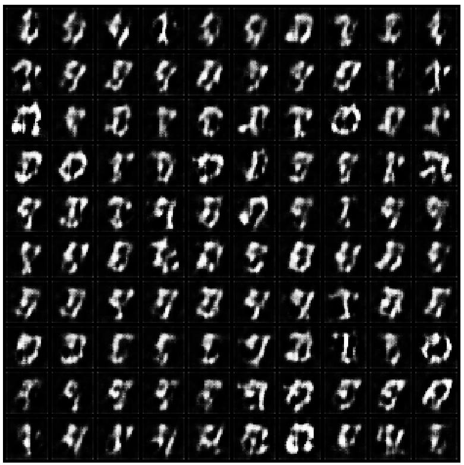
<td>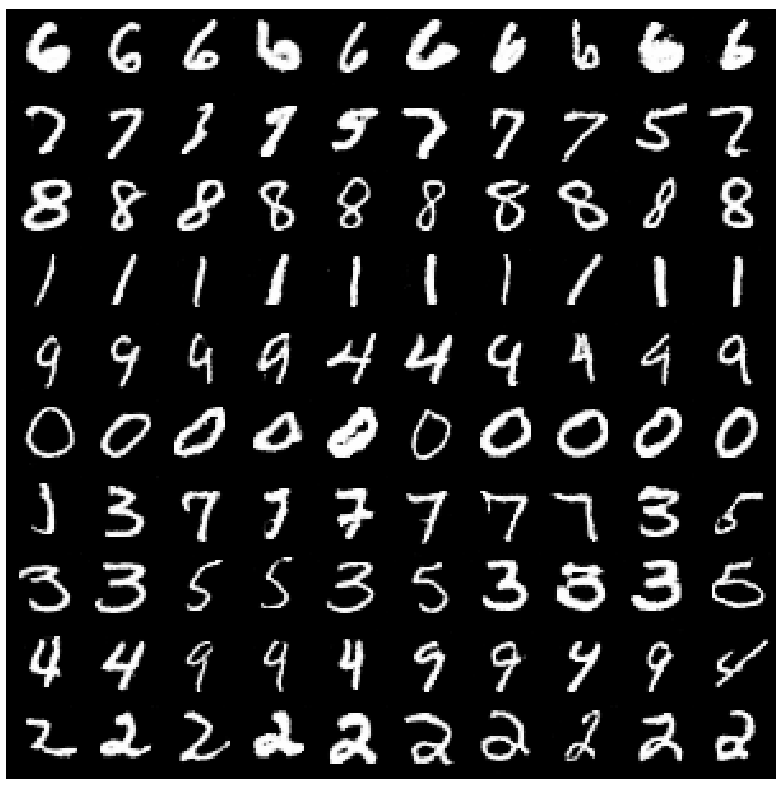
<td>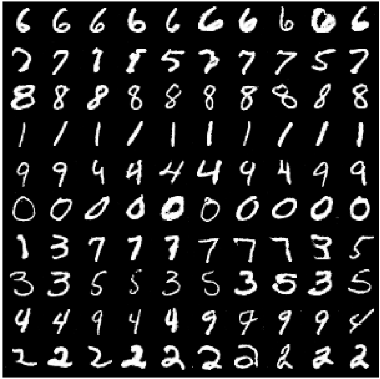
</tr>
</table>

#### Training Loss Curve:


#### Manipulating Latent Code

**Rotation of digits.** <br>
*Row represents categorical variable from K = 0 to K = 9 (top to buttom) to characterize digits.
Column represents continuous variable varying from -2 to 2 (left to right).*<br>
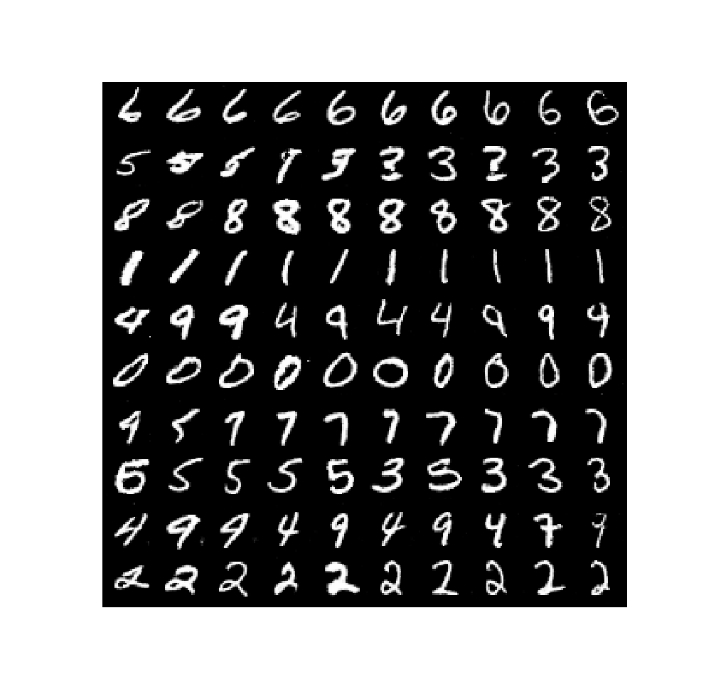 <br>
**Variation in Width**<br>
*Row represents categorical variable from K = 0 to K = 9 (top to buttom) to characterize digits.
Column represents continuous variable varying from -2 to 2 (left to right).* <br>
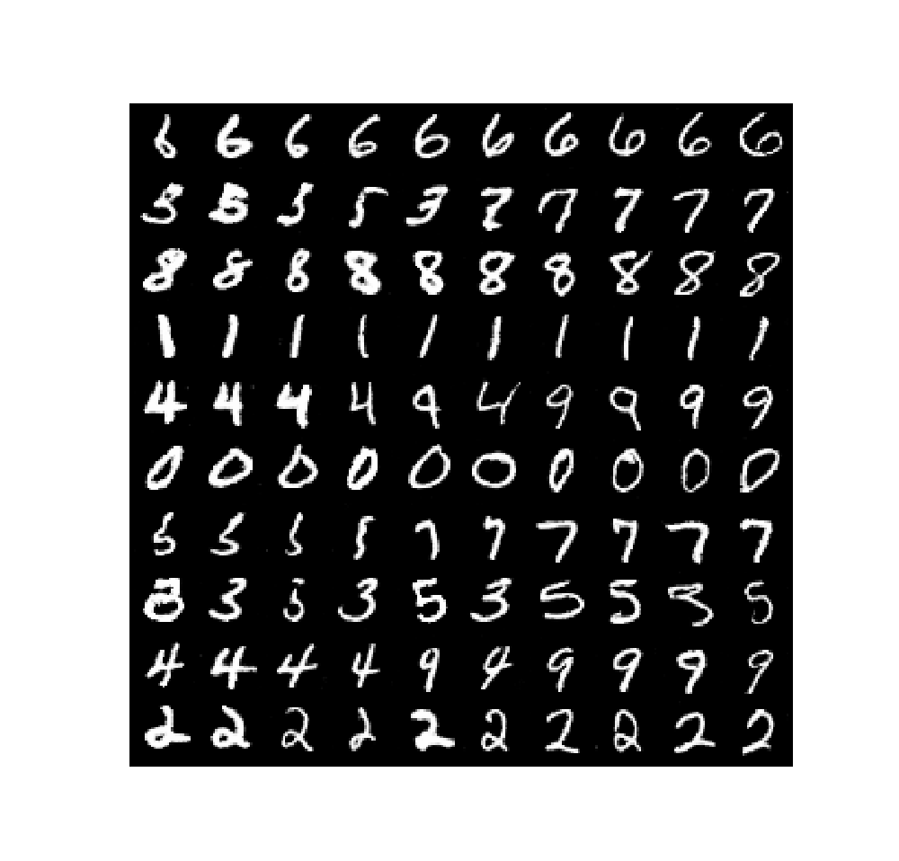 


### FashionMNIST
<table align='center'>
<tr align='center'>
<th> Training Data </th>
<th> Generation GIF </th>
</tr>
<tr>
<td>
<td>
</tr>
</table>

<table align='center'>
<tr align='center'>
<th> Epoch 1 </th>
<th> Epoch 50 </th>
<th> Epoch 100 </th>
</tr>
<tr>
<td>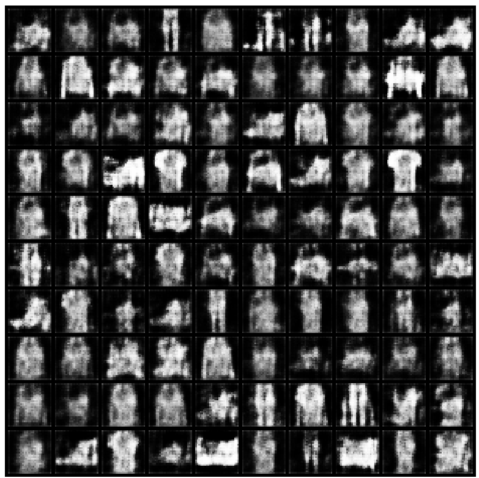
<td>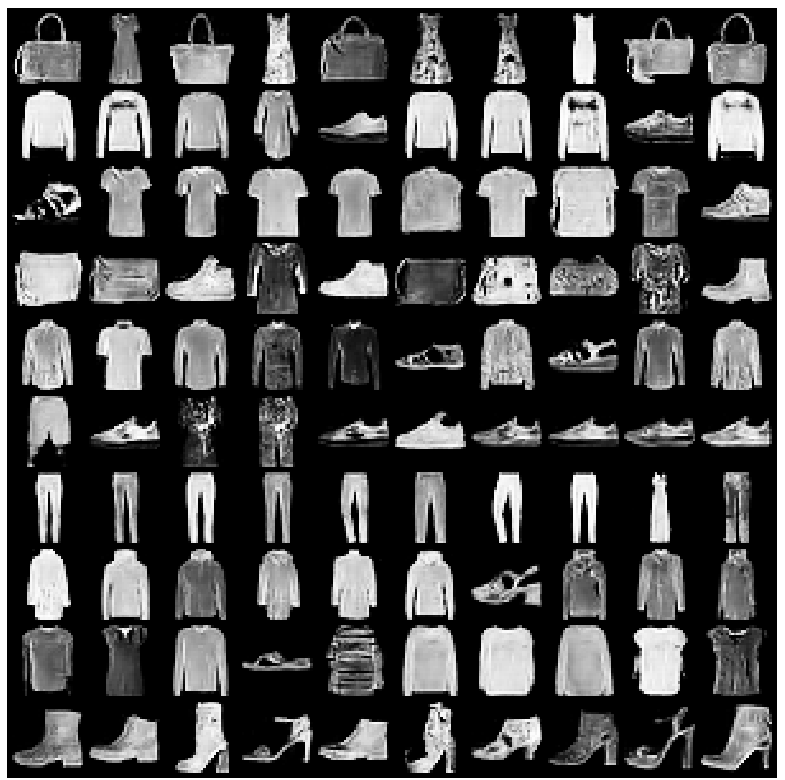
<td>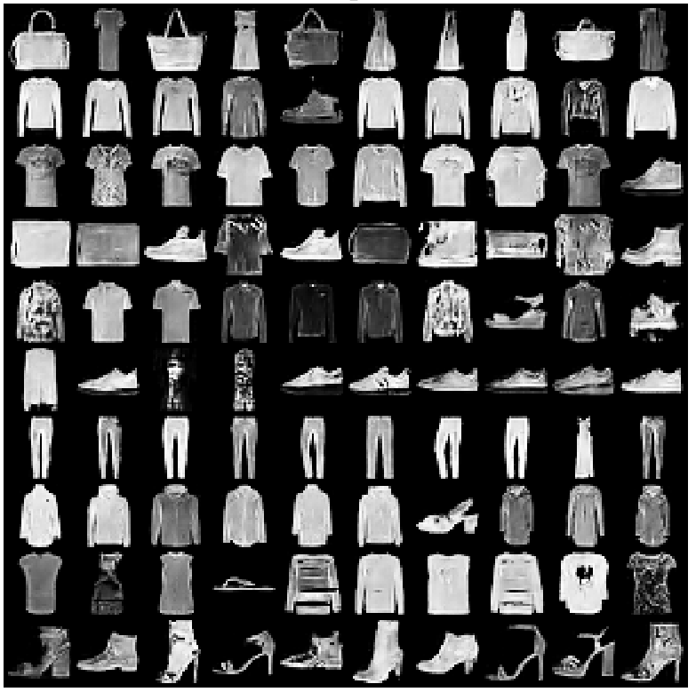
</tr>
</table>

#### Training Loss Curve:


#### Manipulating Latent Code

**Thickness of items.** <br>
*Row represents categorical variable from K = 0 to K = 9 (top to buttom) to characterize items.
Column represents continuous variable varying from -2 to 2 (left to right).*<br>
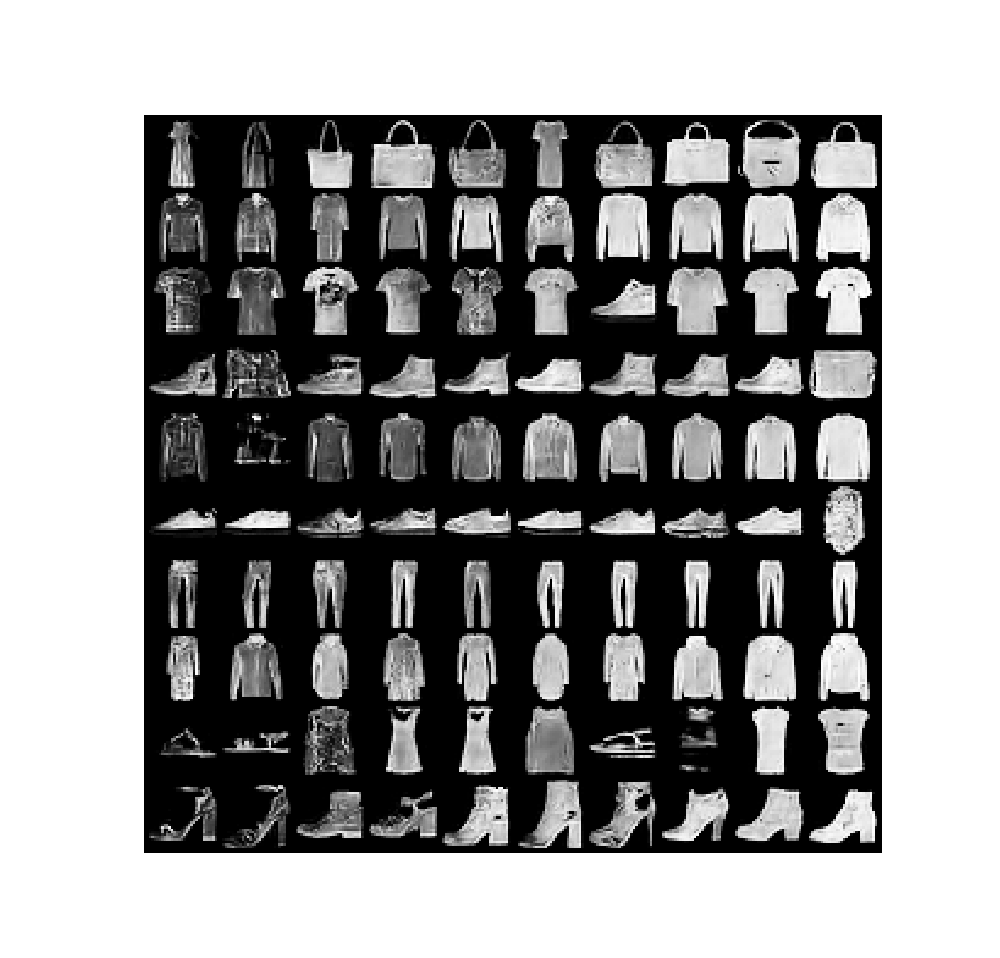 <br>

### SVHN
<table align='center'>
<tr align='center'>
<th> Training Data </th>
<th> Generation GIF </th>
</tr>
<tr>
<td>
<td>
</tr>
</table>

<table align='center'>
<tr align='center'>
<th> Epoch 1 </th>
<th> Epoch 50 </th>
<th> Epoch 100 </th>
</tr>
<tr>
<td>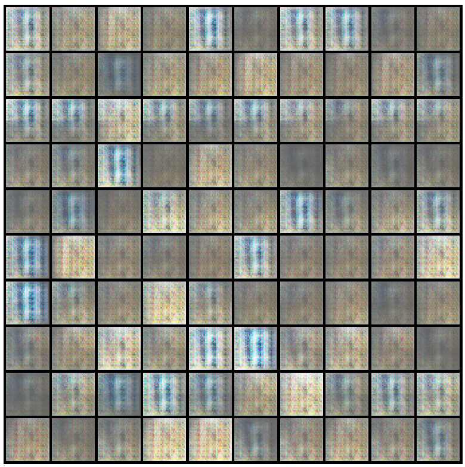
<td>
<td>
</tr>
</table>

#### Training Loss Curve:


#### Manipulating Latent Code

**Continuous Variation:** *Lighting* <br>
 <br>
**Discrete Variation:** *Plate Context* <br>
 <br>

### CelebA
<table align='center'>
<tr align='center'>
<th> Training Data </th>
<th> Generation GIF </th>
</tr>
<tr>
<td>
<td>
</tr>
</table>

<table align='center'>
<tr align='center'>
<th> Epoch 1 </th>
<th> Epoch 50 </th>
<th> Epoch 100 </th>
</tr>
<tr>
<td>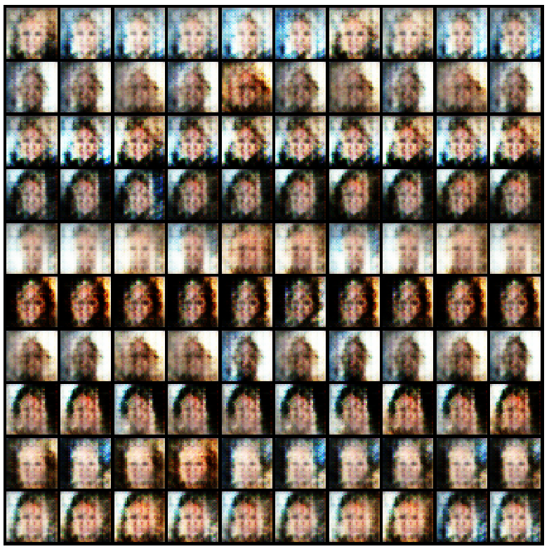
<td>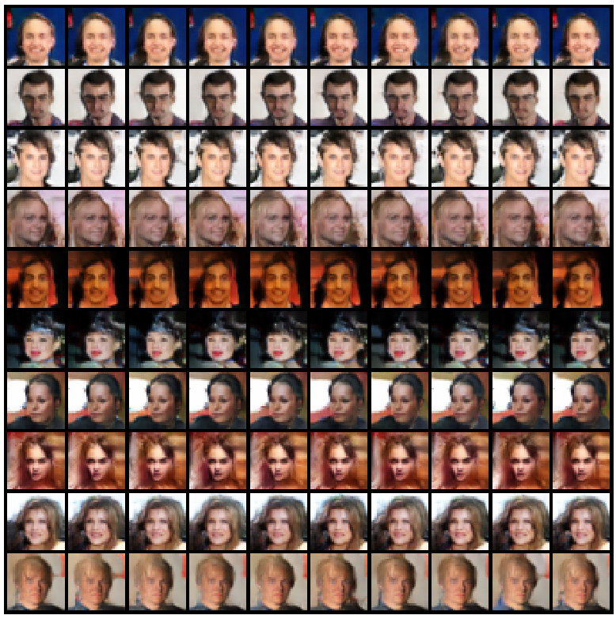
<td>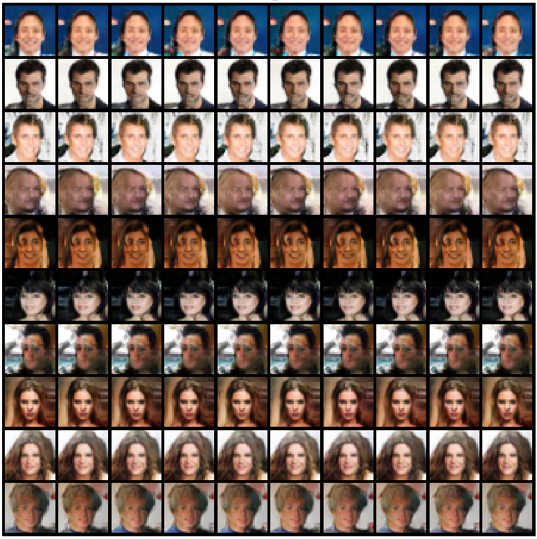
</tr>
</table>

#### Training Loss Curve:


#### Manipulating Latent Code

**Azimuth (pose)** <br>
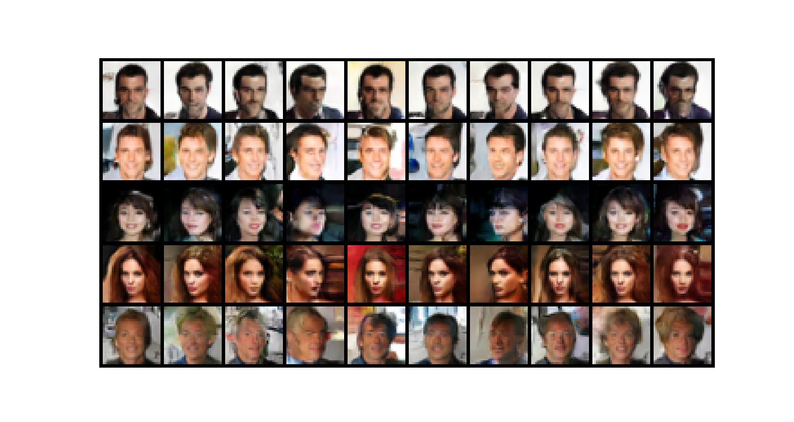 <br>
**Gender:** *Roughly ordered from male to female (left to right)*<br>
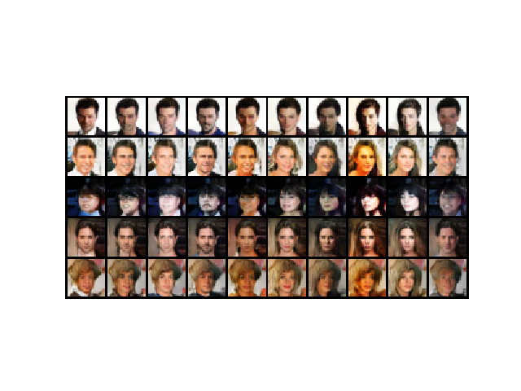 <br>
**Emotion** <br>
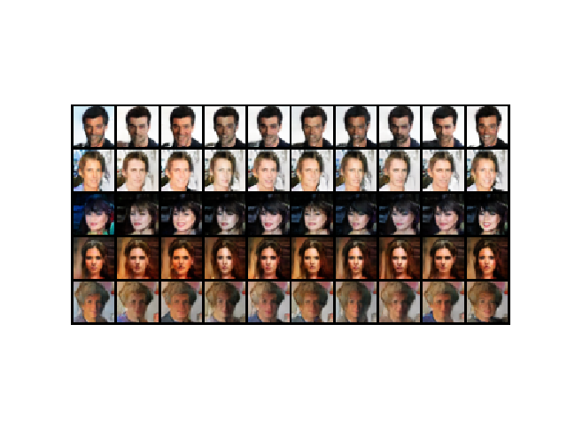 <br>
**Hair Style and Color** <br>
 <br>
**Hair Quantity:** *Roughly ordered from less hair to more hair (left to right)*<br>
 <br>

## References
1. **Xi Chen, Yan Duan, Rein Houthooft, John Schulman, Ilya Sutskever, Pieter Abbeel.** *InfoGAN: Interpretable Representation Learning by Information Maximizing Generative Adversarial Nets.* [[arxiv](https://arxiv.org/abs/1606.03657)]
2. **pianomania/infoGAN-pytorch** [[repo](https://github.com/pianomania/infoGAN-pytorch)]
